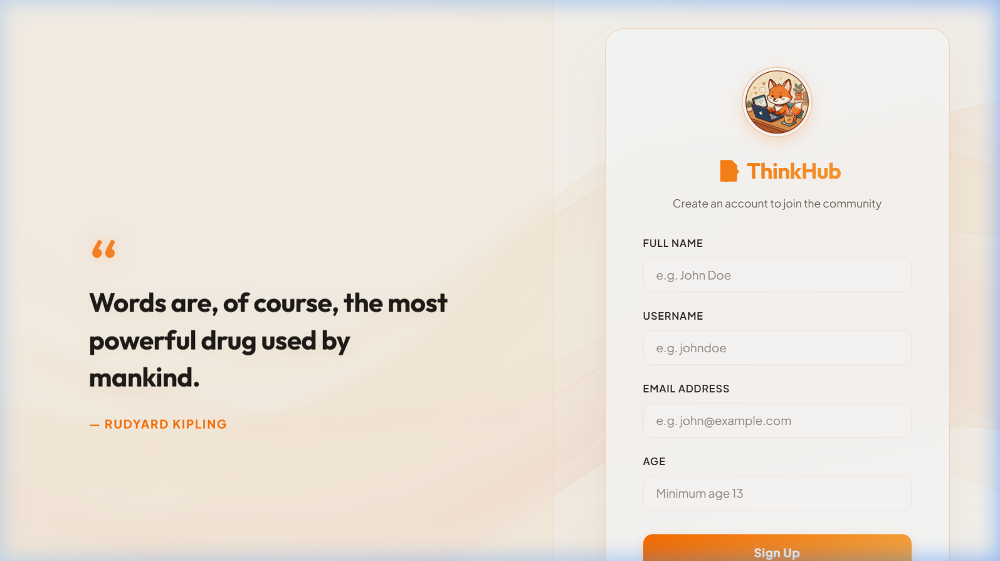
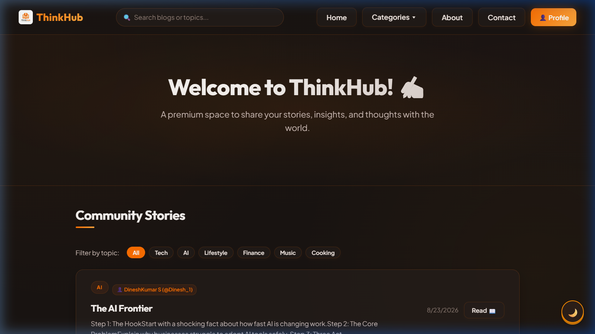
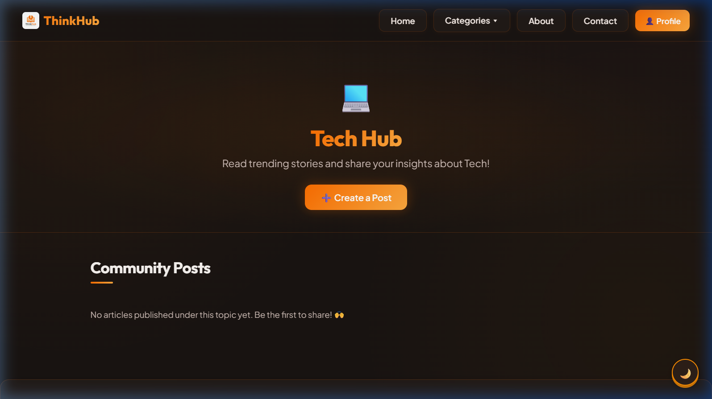
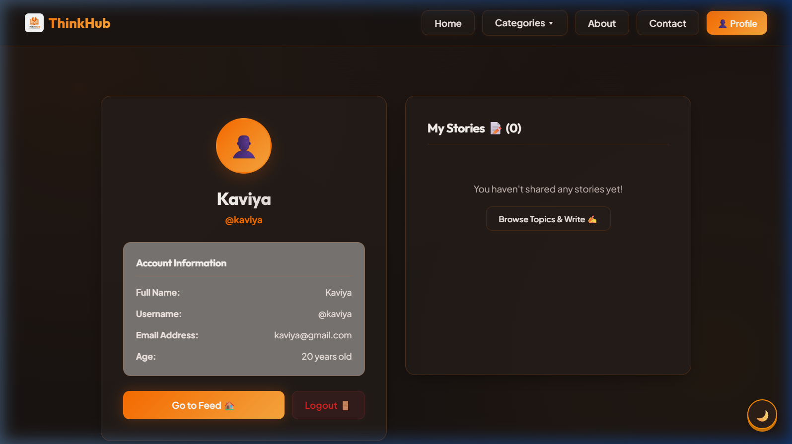

# 📝 ThinkHub — Community Blog Web Application

> A modern, full-stack blogging platform where anyone can register, explore a wide range of topics, and share their thoughts with the world.

<div align="center">

[](LICENSE)
[](#)
[](#)
[](#)
[](#)
[](#)

</div>

---

## 📌 About The Project

**ThinkHub** is a responsive full-stack MERN blogging application.

The goal is to design a clean, distraction-free space for sharing knowledge and insights. Users can register instantly, explore **14 specialized topic categories**, publish posts with rich text, and delete posts they no longer wish to share.

---

## 🎨 14 Blog Topic Channels

Discover and contribute to the following categories:

| Category | Emoji | Category | Emoji |
| :--- | :--- | :--- | :--- |
| **Lifestyle** | 🧘 | **Movie Reviews** | 🎥 |
| **Health** | ❤️ | **Music** | 🎵 |
| **Fitness** | 💪 | **Podcast Reviews** | 🎙️ |
| **Tech** | 💻 | **Investments** | 📈 |
| **AI** | 🤖 | **Money** | 💰 |
| **Cooking** | 🍳 | **Finance** | 🏦 |
| **Entertainment** | 🎬 | **Jokes** | 😂 |

---

## ✨ Features

* 🔐 **Dual-Mode Authentication:** Toggle instantly between Sign Up and Login. Signing in checks credentials passwordlessly using your email.
* 🔍 **Live Search Dropdown:** Dynamic, glassmorphic dropdown below the search bar that updates in real-time, showing matching topics and blog post titles globally.
* 👤 **My Profile Dashboard:** A separate user profile page displaying your Name, Username, Email, and Age, along with a feed of all stories published by you.
* 🗑️ **Story Management:** Delete your published posts directly from the category topic feed or from your dedicated Profile Dashboard.
* 📬 **Contact Mailer Integration:** Submit feedback forms that launch your default email client with a styled, emoji-rich, professional layout, while saving a backup log in the backend database.
* 📱 **Cozy Light Mode Theme:** Beautiful warm ivory/cream background palette (`#fdfbf7` / `#f6f3ea`), custom translucent scrollbars, and high-contrast secondary buttons.
* 🔗 **Full SEO Optimization:** Dynamic tag-hoisting using native React 19 elements, JSON-LD structured schemas (`WebSite`, `BreadcrumbList`, `BlogPosting`, `ProfilePage`, `ContactPage`, `AboutPage`), sitemaps, and robots.txt.
* 💾 **Persistent Database:** Secure document management and routing with Express and MongoDB.

---

## 🛠️ Tech Stack

| Layer | Technology | Role |
| :--- | :--- | :--- |
| **Frontend** | React (v19) | Component-based interactive UI with dynamic hook states |
| **Routing** | React Router DOM (v7) | Fast client-side routing and clean URL parameter tracking |
| **Backend** | Node.js, Express.js | Robust server routing, REST API controllers, and middleware |
| **Database** | MongoDB, Mongoose ODM | Schema definitions, index optimizations, and document storage |
| **Tools** | Git, Postman, Vite | Local version control, API testing, and asset bundle building |

---

## 📁 Project Directory Structure

```text
ThinkHub--A-Community-Blog-Web-Application/
│
├── backend/                  # Node.js + Express Backend Service
│   ├── models/               # MongoDB Document Schemas
│   │   ├── User.js           # User schema (Name, Email, Age validation)
│   │   ├── Post.js           # Blog Post schema (Title, Description, Topic, Date)
│   │   └── Feedback.js       # Feedback schema (Name, City, Email, Message)
│   ├── routes/               # Express App Routing handlers
│   │   ├── userRoute.js      # Authentication endpoints & Feedback logs
│   │   └── postRoute.js      # Post creation, retrieval, and deletion
│   ├── .env                  # Environment configurations (Port & MongoDB URI)
│   └── Server.js             # Server startup and MongoDB integration
│
└── ThinkHub/                 # Vite + React Frontend Interface
    ├── public/               # Static assets (manifest.json, sitemap.xml, robots.txt)
    └── src/                  # React Application Codebase
        ├── assets/           # Media & static logos
        ├── App.jsx           # Application routing definitions
        ├── Signup.jsx        # Login & Signup toggle interface
        ├── Home.jsx          # Home feed showing recent global posts & topic chips
        ├── Topic.jsx         # Categories view with post forms & modals
        ├── Profile.jsx       # User dashboard displaying user info & personal posts
        ├── About.jsx         # Static about page styled like Categories page
        ├── Contact.jsx       # Dynamic contact form with prefilled mail client triggers
        ├── config.js         # API Base URLs configuration
        ├── index.css         # Cozy design styling tokens, animations, and dark theme
        └── main.jsx          # React app DOM entrypoint
```

---

## 🚀 Getting Started

### 📋 Prerequisites
* **Node.js** (v18.0.0 or higher recommended)
* **npm** or **yarn**
* **MongoDB Local Installation** or a **MongoDB Atlas Database Connection**

### ⚙️ Installation & Configuration

#### 1. Clone the Repository
```bash
git clone https://github.com/DineshKumar-02/ThinkHub--A-Community-Blog-Web-Application.git
cd ThinkHub--A-Community-Blog-Web-Application
```

#### 2. Set Up the Backend
1. Navigate to the backend folder:
   ```bash
   cd backend
   npm install
   ```
2. Create a `.env` file in the `backend` folder:
   ```env
   MONGO_URI=mongodb://localhost:27017/thinkhub
   PORT=5000
   ```
3. Start the backend server:
   ```bash
   node Server.js
   ```
   *(Expected log: `MongoDB Connected!` & `Server running on port 5000`)*

#### 3. Set Up the Frontend
1. In a new terminal window, navigate to the `ThinkHub` directory:
   ```bash
   cd ThinkHub
   npm install
   ```
2. Start the Vite development server:
   ```bash
   npm run dev
   ```
3. Open your browser and navigate to `http://localhost:5173` to explore the app.

---

## 📡 API Endpoints & Usage

### 🔐 User Authentication

#### `POST /api/users/signup`
Creates a new user profile.
* **Payload Format:** JSON
* **Request Schema:**
  ```json
  {
    "name": "Jane Doe",
    "email": "jane@example.com",
    "age": 20,
    "username": "janedoe"
  }
  ```
* **Response (201 Created):**
  ```json
  {
    "success": true,
    "message": "Signup successful",
    "user": {
      "_id": "64fb32c...",
      "name": "Jane Doe",
      "email": "jane@example.com",
      "age": 20,
      "username": "janedoe"
    }
  }
  ```
* **Validation:** All inputs are required; the user's age must be >= 13.

#### `POST /api/users/login`
Validates registered users passwordlessly by email.
* **Request Schema:**
  ```json
  {
    "email": "jane@example.com"
  }
  ```

---

### ✍️ Blog Posts Management

#### `POST /api/posts/add`
Publishes a new post under a specific topic channel.
* **Payload Format:** JSON
* **Request Schema:**
  ```json
  {
    "title": "Unlocking AI potential",
    "desc": "How modern LLMs are reshaping software engineering.",
    "topic": "AI",
    "username": "janedoe"
  }
  ```

#### `GET /api/posts/:topic`
Retrieves all posts published under a specific topic channel.
* **Request Param:** `topic` (e.g. `Tech`, `AI`, `Cooking`)

#### `GET /api/posts/by-user/:username`
Retrieves all posts written by a specific user.
* **Request Param:** `username` (e.g. `janedoe`)

#### `DELETE /api/posts/:id`
Deletes a blog post by its unique DB ID.
* **Request Param:** `id` (MongoDB ObjectID)
* **Query Param:** `username` (Required for authentication check)

---

### 📬 Feedback & Support

#### `POST /api/users/feedback`
Logs a user feedback entry in the backend database.
* **Request Schema:**
  ```json
  {
    "name": "Jane Doe",
    "city": "New York",
    "email": "jane@example.com",
    "feedback": "Love the clean UI!"
  }
  ```

---

## 📸 Screenshots

> Signup Page · Home Page · Topic Page · Profile Dashboard




 

---

## 🎯 Key Learning Outcomes

During the build process, the following technical goals were met:
* **End-to-End MERN Architecture:** Developed a clear understanding of the full lifecycle of data moving between React, Node/Express, and MongoDB.
* **API Design & Validation:** Created REST API endpoints with robust Express validators and Mongoose validation rules.
* **State & Navigation Control:** Leveraged React Router DOM for routing configurations, ensuring consistent views without page reloads.
* **Database Management:** Used Mongoose ODM for queries, deletion routines, and mapping connections safely.
* **Vite Tooling:** Handled project creation and configurations with Vite for optimal developer workflow.

---

## 📄 License

This project is open-source and licensed under the [MIT License](LICENSE).
